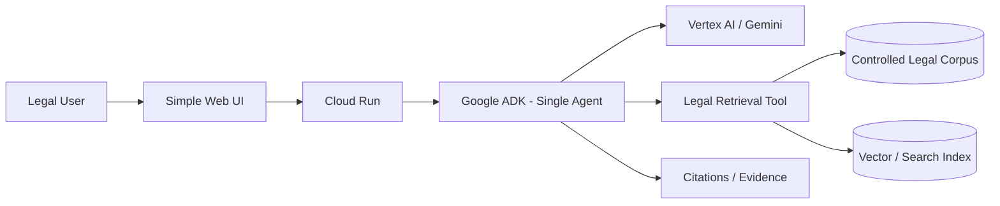
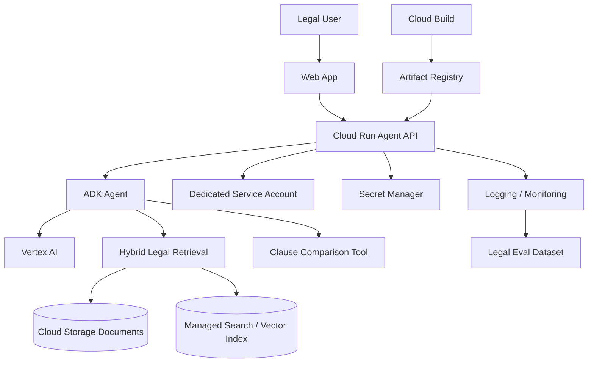
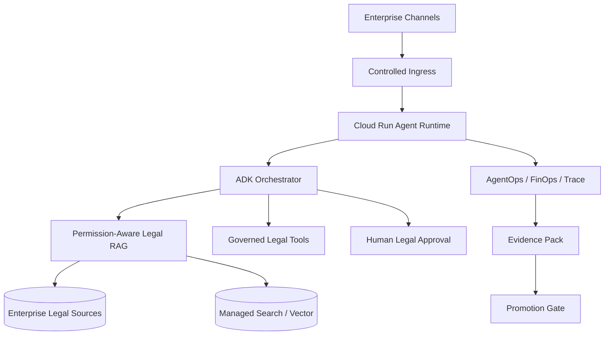

# AgenteLegal — DevPattern Reference Architecture

## FAST DEMO — GCP

### Executive Purpose

> Prove that legal users can obtain evidence-backed answers from a controlled legal corpus with the minimum viable architecture.

| Component | C-Level explanation | Why now |
|---|---|---|
| Simple Web UI | Gives legal users a simple entry point. | Enough to validate usability without overbuilding. |
| Cloud Run | Executes the agent on demand. | Low operational cost and scale-to-zero. |
| Google ADK | Structures agent behavior and tool use. | Keeps orchestration explicit and reusable. |
| Gemini / Vertex AI | Interprets legal questions and synthesizes grounded responses. | Core reasoning capability. |
| Legal Retrieval Tool | Finds relevant legal evidence. | Retrieval must be controlled and testable. |
| Controlled Legal Corpus | Limits the demo to trusted content. | Reduces ambiguity and risk during validation. |
| Vector/Search Index | Accelerates relevant retrieval. | Required for semantic search over documents. |
| Citations / Evidence | Lets legal reviewers verify answers. | Critical trust mechanism for legal use. |

### Why not more?

FAST DEMO intentionally avoids:
- multi-agent;
- GraphRAG;
- Eventarc/PubSub;
- GKE;
- complex private networking;
- dedicated clusters;
- production HA.

These appear only when evidence shows a concrete need.

---

## MVP

### Executive Purpose

> Make the legal assistant repeatable, measurable, integrated and supportable.

Key MVP additions:
- hybrid retrieval where benchmarked;
- repeatable ingestion;
- dedicated identity;
- secrets management;
- observability;
- legal eval dataset;
- CI/CD;
- regression evidence.

---

## PRODUCT

### Executive Purpose

> Operate legal AI as a governed enterprise capability with permission-aware retrieval, auditability and controlled releases.

Add only when justified:
- permission-aware retrieval;
- private connectivity;
- enterprise SSO/IAM;
- stronger ingestion lifecycle;
- GraphRAG if benchmark evidence proves value;
- multi-agent only if specialist/security/context boundaries justify it;
- formal promotion/rollback;
- AgentOps/FinOps.

## Evolution Rule

> Start with single-agent RAG. Add architectural complexity only when measured legal quality, security, scale or operability requires it.
